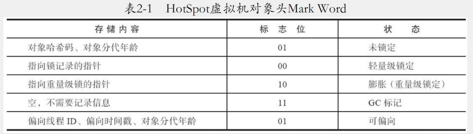
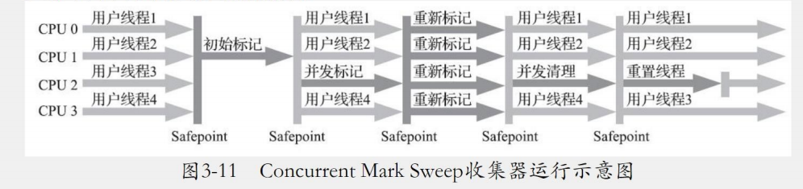
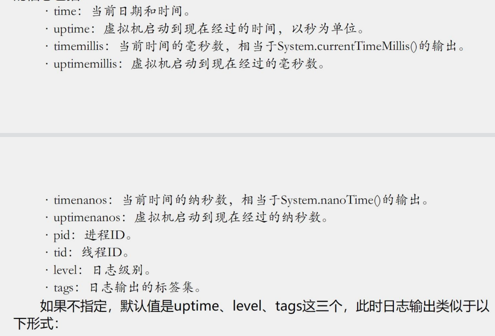

# JVM

## 第二章  Java内存区域与内存溢出异常

### 2.2 运行时数据区域

#### 2.2.1 程序计数器（私有）

​		计数器可以看做当前程序执行的字节码的行号指示器，它是程序控制流的指示器，分支、循环、跳转、异常处理、线程恢复等基础功能需要计数器来完成。

#### 2.2.2 java虚拟机栈（私有）

​		1 java虚拟机栈的生命周期和线程相同。

​		2 虚拟机栈描述的是java方法执行的线程内存模型：执行每个方法创建栈帧用于存储局部变量表、操作数栈、动态连接、方法出口等信息。每个方法被调用直到结束的过程，就会对应一个栈帧的入栈到出栈过程。

​		3 局部变量存储：基本类型（boolean、byte等八种数据类型）、对象引用（）和returnAddress类型

#### 2.2.3 本地方法栈（私有）

​		为虚拟机使用到的本地（Native）方法服务。

#### 2.2.4 Java堆（共享）

​		Java堆是共享最大的内存区域，在虚拟机启动时几乎所有对象实例都在这里分配的。

#### 2.2.5 方法区（共享）

​		用于存储已经被虚拟机加载的类型信息、常量、静态变量、及时编译器编译后的代码缓存数据等。

#### 2.2.6 运行时常量池

​		是方法区的一部分。Class文件中除了有类的版、字段、方法、接口等描述，还有一项常量池表，用于存放编译器生成的**各种字面量**（ `int a = 8`中的8和`String a = "hello"`中的hello都是字面量 ）与**符号引用**（ 一个字符串，只要是非字面量，类加载时 就会将这个符号引用（字符串）解析成直接引用（指针） ）。

#### 2.2.7 直接内存

​		在配置内存的-Xmx要看物理机本身的存储大小

### 2.3 HotSpot虚拟机对象探秘

#### 2.3.1 对象的创建

​		1 遇到new指令，需要检查常量池中定位到一个类的符号引用，并检查这个符号引用是否已被加载、解析和初始化。没有就走类的加载过程。

​		2 指针碰撞：使用过的放一边，空闲的内存放另一边，中间放着一个指针作为分界点的指示器。

​				Serial、ParNew等带压缩整理过程的收集器

​		3 空闲列表：内存不是规整，已使用和未使用相互交错，虚拟机就好维护一个列表，记录可用的，分配从列表中找到一个足够大的空间划分。并更新维护。

​				CMS这种基于清除算法的收集器。

​		4 那种分配根据Java堆是否规整，Java堆是否规整根据垃圾收集器的能力决定。

#### 2.3.2 对象的内存布局

​		1 对象在堆内存中的存储布局分为三个部分：对象头（header）、实例数据（Instance Date）、对齐填充（Padding）。

​		2 对象头部分分两类：

​				第一类：存储对象自身的运行时数据如：哈希码（HashCode）、GC分代年龄、锁状态标志、线程持有的锁、偏向线程ID、偏向时间戳等。这部分长度在32和64位的虚拟机（未开启压缩指针）中分别为32和64个比特。

#### 2.4.1 Java堆溢出

#### 2.4.2 虚拟机栈和本地方法栈溢出

#### 2.4.3 方法区和运行时常量吃溢出

## 第三章 垃圾收集器与内存分配策略

### 3.2 对象已死

#### 3.2.1 引用计数算法

​		引用计数算法，用的时候加1，失效减一

​		缺陷：

#### 3.2.2 可达性分析算法

 		引用链：GC Roots作为根节点，根据引用关系向下搜索，搜索过程所走过的路。

#### 3.2.3 再谈应用	

​		对象引用：如果reference类型的数据中存储的数据值代表的是另一块内存的起始地址，reference数据是代表模块的内存。

​		强引用：类似Object obj = new Object() 这种引用关系，无论什么情况只要强引用关系还在都不会被垃圾回收调。

​		软引用：描述一些还有用，但非必须的对象，在系统将要发生内存溢出异常前回收，如果回收后还不足抛出异常。

​		弱引用：比软引用更弱些，被弱引用关联的对象只能生存到下一次垃圾收集发生为止，无聊内存是否够用都会回收。

​		虚引用：是最弱的引用关系，虚引用对象对生存时间构不成影响，也无法通过虚应用来取得对象的实例。虚引用被回收时会收到一个系统通知。

#### 3.2.4 回收方法区

​		方法区的垃圾收集器只要回收两部分内容：废弃的常量和不在使用的类型。

​		常量回收：

​					1 该类所有的实例都已经被回收，java堆中不在存在该类的派生子类的实例

​					2 加载该类加载器已经被回收，

​					3 该类对应的java.lang.Class对象没有任何地方被引用。

​		满足三个条件，然后经大量计算才能回收。

### 3.3 垃圾收集算法

​		如果判断对象消亡

​			1 引用计数式垃圾收集（直接垃圾收集）

​			2 追踪式垃圾收集（间接垃圾收集）

#### 3.3.1 分代收集理论

​			1 弱分代假说：绝大多数对象都是朝生夕灭

​			2 强分代假说：熬过越多次垃圾收集器过程的对象就越难消亡。

#### 3.3.2 标记-清除算法

​		缺点：

​				1 执行效率不稳定。如果Java堆中包含大量对象，大部分都要被回收。

​				2 内存空间浪费碎片化问题。会出现大量的不连续空间碎片，如果要分配较大的对象时找不到足够的空间

#### 3.3.3 标记-复制算法

​		解决空间碎片不连续问题。

​		需要将可用的内存空间容量划分为大小相等的两块，每次使用其中一块，一块用完就会将存活的复制到另一块，并清除。

​		缺点：

​			浪费内存空间，每次只能使用一半。

#### 3.3.4 标记-整理算法

​		和标记清除算法一样，但在后续先让存活的一端移动，在清除。		

 		

### 3.4 HotSpot的算法细节实现

先跳过

### 3.5 经典垃圾收集器

#### 3.5.1 Serial收集器

​		serial执行收集时会将所有线程停掉，收集结束后恢复线程。

#### 3.5.2 ParNew收集器

​		多线程同时执行收集器，如果是单核cup不然serial收集器

​		cms收集器可以支持并发收集器，可以让垃圾收集器与用户线程同时运行。

#### 3.5.3 Parallel Scavenge收集器

​		parallel Scavenge收集器同样与标记-复制算法事项收集器。

​		可设置控制最大垃圾收集器停顿时间、吞吐量大小的参数。

#### 3.5.4 Serial old 收集器 标记整理算法

​		单线程使用，是serial的老年版本

#### 3.5.5 Parallel Old收集器 标记整理算法

#### 3.5.6 CMS收集器

​		执行过程分四部

​				1 初始标记 ：初始化GCRoots能直接关联到的对象，速度很快

​				2 并发标记 ：将GCRoots的直接关联对象开始遍历整个对象图的过程 这个时间长

​				3 重新标记 ：修正并发标记期间因用户程序继续运作而导致标记产生变动 这个时间也长没有并发标记时间长

​				4 并发清除 ： 清除已经标记死亡对象，可以和用户线程并发执行

​		三个缺点

​				1 对资源比较敏感，会占一部分线程 CMS默认启动回收线程数是（处理器核心数量+3）/4  会占25%资源。

​				2 浮动垃圾，因不能有用户线程在使用，需要留出足够的空间给用户线程使用。

​				3 CMS是标记清除，导致有很多空间碎片，导致大对象分配找不到足够大的空间。

#### 3.5.7 Garbage First收集器

​		Garbage First（G1）收集器

​		G1收集器的运行过程分四部：

​				初始标记：标记GC Roots 能直接关联到的对象，并修改TAMS指针值，让下一阶段用户线程并发运行时能正确的在可用Region中分配新对象。这个阶段需要停顿，耗时很短。

​				并发标记：从GCRoots开始对堆中对象进行可达性分析，递归扫描整个堆中的对象图，找到要回收的对象，耗时较长，但可与用户线程并发执行，扫描完后重新处理SATB记录下并发时变动对象。

​				最终标记： 对用户线程做个另一个短暂的暂停，用于处理并发后仍遗留的少了SATB记录。

​				筛选回收： 负责更新Region的统计数据，对各个Region的回收价值和成本进行排序，根据用户停顿时间来制定回收计划，可以自由选择多个Region构成回收集，然后把需要回收的Region的存活对象复制到空Region中，在清理旧Region的全部空间，这里是对象移动，必须停止用户线程，由多条收集器并发完成。

### 3.6 低延迟垃圾收集器

​			衡量垃圾收集器指标：内存占用、吞吐量、延迟。

#### 3.6.1 Shenandoah收集器

​			收集器分九个阶段：

​				初始标记：与G1一样，和GCRoots直接关联对象

​				并发标记：与G1一样，遍历对象图

​				最终标记：与G1一样，处理剩余的SATB扫描，统计出回收价值最高的Region。最终标记阶段会小短暂的停顿。

​				并发清理：清理整个区域连一个存活对象都没有找到的Region

​				并发回收：把回收集里面存活对象先复制一份到其他未被使用的Region中。时间长短取决于回收集的大小

​				初始引用更新：并发回收阶段复制对象结束后，需要把堆中所有指向旧对象修正复制后的新地址

​				并发引用更新：将内存物理地址的顺序线性的搜索出应用类型，把旧地址改为新值即可

​				最终引用更新：修正GCRoots中的引用 停顿时间和GCRoots的数量相关

​				并发清理：最后一次并发清理回收Region的内存空间，供新对象分配使用

es中 200G索引

#### 3.6.2 ZGC收集器

​		并发标记：遍历对象图做可达性分析阶段，ZGC标记是在指针上而不是对象上，标记阶段会更新染色指针中的Marked0、Marked1标志位

​		并发预备重分配：根据特定查询条件统计收集过程要清理那些Region

​		并发重分配：重分配集中存活对象复制到新的Region上，并为重分配集中的每个Region维护一个转发表，记录从旧对象到新对象的转向关系。

​		并发重映射：修正整个堆中指向重新分配集中旧对象的所有引用。

### 3.7 选择合适的垃圾收集器

​		一个垃圾收集器处理垃圾收集这个本职工作之外，还负责管理与布局、对象的分配、解释器的协作、与编译器的协作、监控子系统协作等职责，其中至少堆的管理和对象的分配这部分功能是java虚拟机能够正常运行的必要支持。

#### 3.7.1 Epsilon收集器

​		Epsilon：无操作的收集器，Epsilon是这个接口的有效性验证和参考实现。

​		作用：如果应用只要运行分钟甚至数秒，只要Java虚拟机能正确分配内存，在对耗尽之前退出。

#### 3.7.2 收集器的权衡

​		收集器影响因素：

​			1 应用程序主要关注：

​					数据分析、科学计算的任务：关注的是吞吐量

​					如果是SLA应用：关注的延迟问题

​					客户端应用或者嵌入式应用：关注的内存占用

​			2 运行应用的基础建设如果

​					涉及：硬件规格、系统架构、处理器数量、内存大写、选择系统

​			3 JDKd 的发行厂商

​					发行版本：jdk和openjdk的选择版本的选择

#### 3.7.3 虚拟机及垃圾收集器日志

​		日志级别：Trace、Debug、Info、Warning、Error、off  默认info

​		装饰器（Decorator）

## 第四章 虚拟机性能监控、故障处理工具